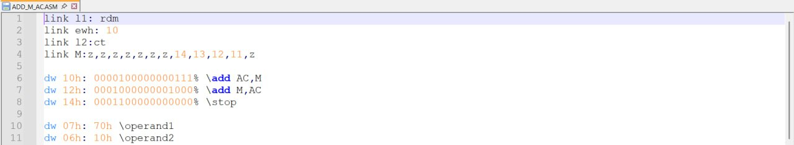
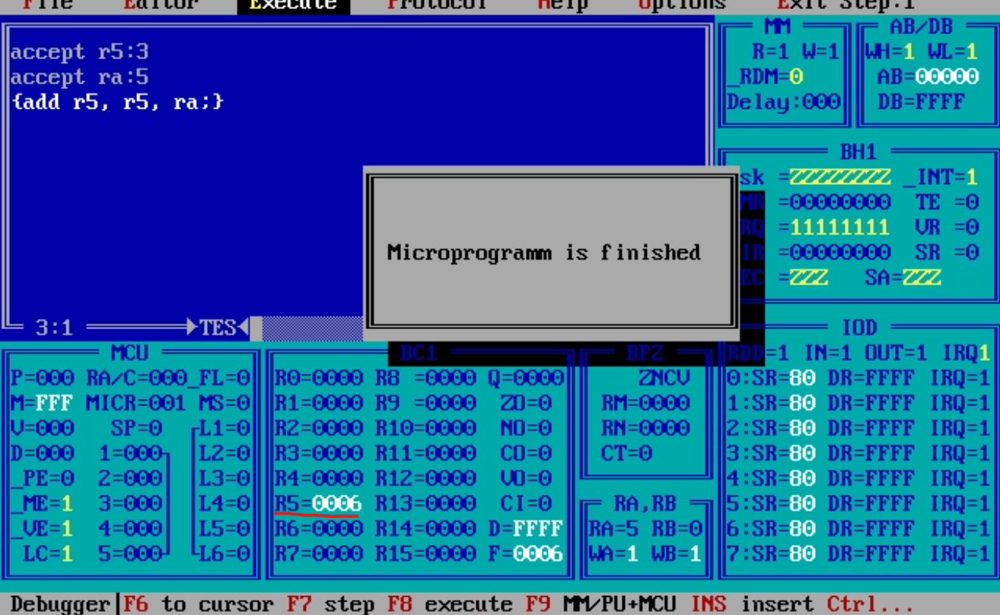

# MicroAssemblerDocumantation

## A.1. Трансляція мікропрограми
Мнемонічний двопроходний мікроасемблер призначений для розробки мікропрограм. 
Результатом роботи мікроасемблера є файл даних з розширенням «*.pmk».

Вихідним файлом для мікроасемблеру є текстовий файл в кодах ASCII з розширенням «*.asm». Між окремими мнемоніками може бути будь-яке число службових символів, наприклад, пробіл, табуляція, повернення каретки, переклад рядка і таке інше.

Приклад текстового файлу (в кодах ASCII) можна писати в будь якому текстовому редакторі:



### Коментарі
Коментарі використовуються для пояснень. Ознакою початку коментарю є символ «\ ». Далі мікроасемблер ігнорує всі символи, які зустрічаються, до наступного «\» або до кінця рядка.

Наприклад:

```
{add r11,r11,r10,z;} \додати до вмісту R11 вміст R10
```

### Числові константи
Числові константи застосовуються під час завдання значень операндів і адрес. Ознакою константи є цифра на початку мнемоніки.

Наприклад:
```
\способи завдання констант у різних системах числення
65535 \десяткова константа
0FFFFh \шістнадцатирічна константа
177777o \вісімкова константа
1111111111111111% \двійкова константа
```
Буква в кінці залежить від того, в якій системі числена записане число.

### Мнемонічний запис мікрокоманд

> [!NOTE]
> Будь яку команду або регістр можна називати без залежності регіста. Тобто **add** або **ADD** воно сприйме однаково.

Арифметичні мікрокоманди, що виконуються в АЛП, записуються в вигляді.

> [!IMPORTANT]
> Елемент в круглих душках є **НЕОБОВ'ЯВКОВИМ ЕЛЕМЕНТОМ КОНСТРУКЦІЇ МІКРОКОМАНДИ**.

```
{<мнемоніка>(<оператор_зсуву>,)(<приймач_результату>,) <джерело_1>,<джерело_2>,<вхідний_перенос>}
```

**Джерелами операндів** (числа для мнемонік) можуть бути два регістри НОЗП (від r0 до r15), а також один регістр (він указується як перше джерело операндів) в комбінації з константою (число в регістрі), bus_d або нулем (записуєтсья як **z** в полі операнда).

**мнемоніка** - дія в мікроопераціях.

Приклад:
* add - додавання R + S + CI
* sub - віднімання R – S – 1 + CI
* or - операція або R or S
* and - операція і R and S
* nand - операція і-не not(R and S)
* xor - операція виключення-або R xor S
* nxor - операція виключення-або-не not(R xor S)

**оператор_зсуву** - варіація дії зсуву.

Приклад:
* sra - Зсув вправо арифметичний
* srl - Зсув вправо логічний
* sr.9 - Зсув вправо з переносом
* sla - Зсув вліво арифметичний
* sll - Зсув вліво логічний
* sl.25 - Зсув вліво з переносом

**приймач_результату** - регістр, в який записується результат мікрокоманди. Цей регістр обов'язково має використовуватись в мікрокоманді (<джерело_1>, <джерело_2>)

**<джерело_1>,<джерело_2>** - можуть приймати значення регістрів **r0-r15**, а також **nil**, ЯКЩО результат не записується, АЛЕ може бути виданий на локальну шину.

> [!NOTE]
> Регістри НОЗП можуть адресуватися непрямо. Якщо в якості джерел операндів зазначені RA та/або RB, то операнди вибираються з регістрів, коди яких записані в RA і RB. 

    

При r5:3 та ra:5 в мікрокоманді, значення ra є посиланням на r5. І у висновку r5 = 0006, так як при виконанні мікрокоманди, воно додало само себе.

**вхідний_перенос** може приймати значення 0, 1 (записується відповідно через z і nz), а також rm_c і not rm_c.

> [!NOTE]
> Використовується при додаванні або відніманні, якщо не хочемо робити переніс (**CI**). 
