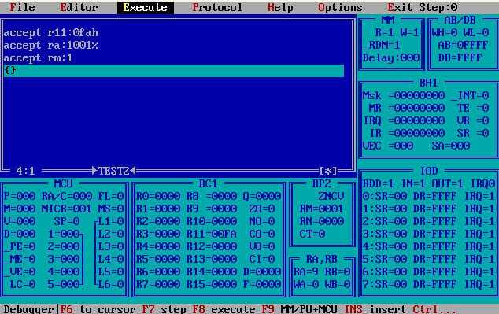
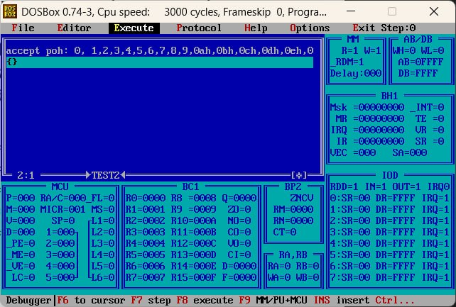
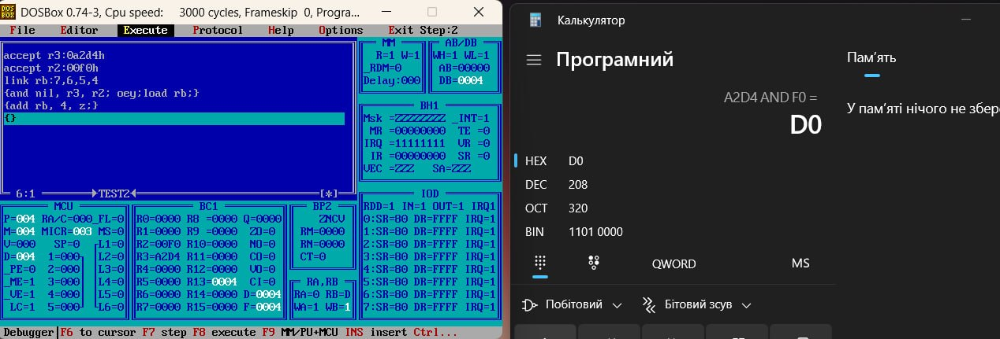
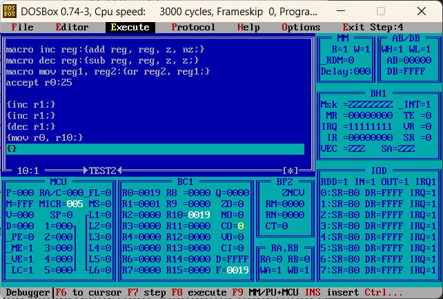

# MicroAssemblerDocumantation

## A.1. Трансляція мікропрограми
Мнемонічний двопроходний мікроасемблер призначений для розробки мікропрограм. 
Результатом роботи мікроасемблера є файл даних з розширенням «*.pmk».

Вихідним файлом для мікроасемблеру є текстовий файл в кодах ASCII з розширенням «*.asm». Між окремими мнемоніками може бути будь-яке число службових символів, наприклад, пробіл, табуляція, повернення каретки, переклад рядка і таке інше.

Приклад текстового файлу (в кодах ASCII) можна писати в будь якому текстовому редакторі:


### Коментарі
Коментарі використовуються для пояснень. Ознакою початку коментарю є символ «\ ». Далі мікроасемблер ігнорує всі символи, які зустрічаються, до наступного «\» або до кінця рядка.

Наприклад:

```
{add r11,r11,r10,z;} \додати до вмісту R11 вміст R10
```

### Числові константи
Числові константи застосовуються під час завдання значень операндів і адрес. Ознакою константи є цифра на початку мнемоніки.

Наприклад:
```
\способи завдання констант у різних системах числення
65535 \десяткова константа
0FFFFh \шістнадцатирічна константа
177777o \вісімкова константа
1111111111111111% \двійкова константа
```
Буква в кінці залежить від того, в якій системі числена записане число.

### Мнемонічний запис мікрокоманд

> [!NOTE]
> Будь яку команду або регістр можна називати без залежності регіста. Тобто **add** або **ADD** воно сприйме однаково.

Арифметичні мікрокоманди, що виконуються в АЛП, записуються в вигляді.

> [!IMPORTANT]
> Елемент в круглих душках є **НЕОБОВ'ЯВКОВИМ ЕЛЕМЕНТОМ КОНСТРУКЦІЇ МІКРОКОМАНДИ**.

```
{<мнемоніка>(<оператор_зсуву>,)(<приймач_результату>,) <джерело_1>,<джерело_2>,<вхідний_перенос>}
```

**Джерелами операндів** (числа для мнемонік) можуть бути два регістри НОЗП (від r0 до r15), а також один регістр (він указується як перше джерело операндів) в комбінації з константою (число в регістрі), bus_d або нулем (записуєтсья як **z** в полі операнда).

**мнемоніка** - дія в мікроопераціях.

Приклад:
| Мнемоніка                   | Мікрооперація в АЛБ                                                                   |
|-----------------------------|---------------------------------------------------------------------------------------|
| `add`                       | додавання R + S + CI          |
| `sub`                       | віднімання R – S – 1 + CI                  |
| `or`                        | операція або R or S             |
| `and`  | операція і R and S                               |
| `nand`  | операція і-не not(R and S)                               |
| `xor` | операція виключення-або R xor S  |
| `nxor` | операція виключення-або-не not(R xor S)  |

**оператор_зсуву** - варіація дії зсуву.

Приклад:

| Мнемоніка                   | Мікрооперація в АЛБ                                                                   |
|-----------------------------|---------------------------------------------------------------------------------------|
| `sra`                       | Зсув вправо арифметичний          |
| `srl`                       | Зсув вправо логічний                  |
| `sr.9`                        | Зсув вправо з переносом             |
| `sla`  | Зсув вліво арифметичний                               |
| `sll`  | Зсув вліво логічний                               |
| `sl.25` | Зсув вліво з переносом|

**приймач_результату** - регістр, в який записується результат мікрокоманди. Цей регістр обов'язково має використовуватись в мікрокоманді (<джерело_1>, <джерело_2>). а також **nil**, ЯКЩО результат не записується, АЛЕ може бути виданий на локальну шину.

**<джерело_1>,<джерело_2>** - можуть приймати значення регістрів **r0-r15**,

> [!NOTE]
> Регістри НОЗП можуть адресуватися непрямо. Якщо в якості джерел операндів зазначені RA та/або RB, то операнди вибираються з регістрів, коди яких записані в RA і RB. 

    

При r5:3 та ra:5 в мікрокоманді, значення ra є посиланням на r5. І у висновку r5 = 0006, так як при виконанні мікрокоманди, воно додало само себе.

**вхідний_перенос** може приймати значення 0, 1 (записується відповідно через z і nz), а також rm_c і not rm_c.

> [!NOTE]
> Використовується при додаванні або відніманні, якщо не хочемо робити переніс (**CI**). 

## A.2. Директиви мікроасемблера для блока обробки даних

**Директиви мікроасемблера** – це службові мнемоніки, які не транслюються в мікрокоманди мікропрограми.

Вони служать для задання початкових значень в регістрах, по-чаткової адреси мікропрограми в пам„яті мікрокоманд, для настроювання окремих вузлів обчислювальної системи тощо.

### **accept** – директива занесення інформації в регістри БОД

Загальний вигляд директиви:

```
accept <регістр>: <значення>
```

де <регістр>: R0, R1,..., R15, RQ, POH, RM, RN, RA, RB.

Таким чином директива дозволяє задати <значення>:
* в будь-якому з регістрів АЛП,
* одночасно у всіх регістрах АЛП,
* значення ознак в регістрах RM та RN СУСЗ,
* значения в регістрах RA, RB обрамлення БОД.

Приклад завдання **accept**:
```
accept r11:0fah
accept ra:1001%
accept rm:1
{}
```



Директива такого типу дає можливість задати значення в регістрах загального призначення АЛП (Арифметично-логічний пристрій). Після **poh** необхідно задати 16 значень, перше з яких завантажується в регістр R0, останнє в регистр R15 АЛП:
```
accept poh:<16 значень>
accept poh: 0,1,2,3,4,5,6,7,8,9,0ah,0bh,0ch,0dh,0eh,0fh
{}
```



### **link** – директива приєднання регістрів RA, RB до ЛШ

Загальний вигляд директиви:
```
link <регістр>: <4 номери розрядів ЛШ>
```

де **<регістр>** – регістри RA або RB (рис. A.2).

Директива **link** вказує, номери розрядів 16-розрядної локальної шини які мають бути приєднані до виводів 4-розрядних регістрів RA, RB обрамлення БОД.

### **load** – директива завантаження регістрів RA, RB з ЛШ

Загальний вигляд директиви:
```
load <регістр>
```

де **<регістр>** регістри RA або RB.

Директива **load** означає, що в регістр (RA або RB) буде завантажено значення, яке в даний час перебуває на ЛШ (Локальна шина).

Приклад:



```
accept r3:0a2d4h
accept r2:00f0h
link rb: 7,6,5,4
{and nil, r3, r2; oey; load rb;}
{add rb, 4, z}
{}
```

в r3 ми записуємо A2D4, а в r2 записуємо F0. Робимо операцію AND з r3 та r2, що у висновку виходить D0_8 = 1101 0000_2. Так як ми розписали link rb: 7,6,5,4, то ми беремо h7 по h4, тобто 1101, що дорівнює D.

### Мікрокоманди управління регістрами RM та RN

Для завантаження регистрів RM, RN СУСЗ застосовуються наступні мікрокоманди
```
{load rm, z;} \ встановлення всіх розрядів RM в нуль
{load rm, nz;} \ встановлення всіх розрядів RM в одиницю
{load rm,flags;} \ завантаження всіх ознак сформованих
\ під час виконання мікро операції в АЛП
{load rn,flags;} \ завантаження ознак у регістр RN
```

Одночасно з зазначеними мікрокомандами застосовуються мікрокоманди заборони зипису у відповідні розряди RM, а саме cem_c, cem_z, cem_n, cem_v.

### **org** – директива розміщення виконуваного коду мікропрограми в пам’яті мікрокоманд

Загальний вигляд директиви:
```
org <мітка>
org <адреса>
```

Директива org розміщує виконуваний код мікропрограми в ПМК за вказаною адресою.

Приклади застосування директиви org:
```
org 20h
org start
```

### **equ** – директива задання відповідності

> [!NOTE]
> equ еквівалентний до змінних в програмуванні. 

Загальний вигляд директиви:
```
equ <ім‘я>:<значення>
```

Директива equ використовується для присвоєння символічним іменам, що використовуються у мікропрограмі, конкретних числових значень.

Приклади застосування директиви equ:
```
equ start:100
equ оp1:2150
equ оp2:0afh
```

### **macro** – директива створення макрокоманд
Загальний вигляд директиви:
```
macro<ім‘я><формальні_параметри>:{<мікрокоманда>;}
```

Директива macro дозволяє конструювати власні мнемоніки операцій (макрокоманди) і користуватися ними надалі як стандартними.

Приклад:



```
macro inc reg:{add reg, reg, z, nz;}
macro dec reg:{sub reg, reg, z, z;}
macro mov reg1, reg2:{or reg2, reg1;}
accept r0:25

{inc r1;}
{inc r1;}
{dec r1;}
{mov r0, r10;}
{}
```

Ім'я макрокоманди надалі стає для транслятора звичайною стандартною мнемонікою. В якості імен формальних параметрів макроса не можуть бути застосовані зарезервовані мнемоніки. У мікропрограмі макрокоманда задається своїм власним ім„ям (мнемонікою) та реальними операндами, в тому ж самому порядку, в якому вони вказані в макросі.

## A.3. Директиви мікроасемблера для блока мікропрограмного управління

### **link** – директива встановлення відповідності між входами МУ (мультіплексер) та логічними умовами

Якщо в системі мікрокоманд схеми формування адреси мікрокоманди ФАМ, як умови використовуються сигнали на входах мільтиплексора умов МУ – L1, L2, ..., L6 (або not L1, not L2, ..., not L6), то сигнал умови необхідно зв„язати з одним із входів зазначеного мультиплексора за допомогою директиви link. Під час аналізу Li (де i 1, 6) як логічної умови в структурі мікрокоманди у частині призначеній для управляння ФАМ поле MS буде містити двійковий код відповідний до номеру входу умови – i.

Загальний вигляд директиви:
```
link <ім‘я_входу>:<умова>
```

де <ім‘я входу> відповідає L1, ..., L6.

До входів L1, ..., L6 МУ можна приєднувати наступні управляючі сигнали:
```
zo, co, no, vo
rm_z, rm_c, rm_n, rm_v
rn_z, rn_c, rn_n, rn_v
ct
rdm, rdd
int
irq0, ..., irq7
```

Завдання відповідності між входами МУ та умовами за допомогою директиви link може здійснюватись як окремо для кожного входу МУ, так і для всіх входів одночасно за допомогою наступної директиви

```
link l:<шість_умов>)
```

## A.4. Директиви роботи із пам‟яттю та зовнішніми пристроями

### **dw** - директива завдання значень комірок пам'яті має вигляд
```
dw <адреса>:<значення>
```
